# Database Schema Backlog — I Watch Football

This document is a prioritized backlog of schema changes, consolidations, and additions identified during a full database audit. It complements the product-phase plans in [`ticketing-system-design.md`](./ticketing-system-design.md) and [`phase-1-ticketing-monetisation.md`](./phase-1-ticketing-monetisation.md).

---

## How to read this doc

- **Priority tiers:** P0 (fix now) → P4 (defer to later phases / ops)
- **Each item:** Problem → Recommendation → Files / migrations affected
- **Checkboxes:** `- [ ]` items are trackable backlog entries; check off as implemented
- **Scope:** Schema and data-model work only — service-layer rules are noted where they depend on schema decisions

---

## Current schema snapshot

The backend has roughly **60 entity modules** under `backend/src/api/modules/`, plus integration entities under `backend/src/api/integrations/`. Domains:

```mermaid
flowchart TB
    subgraph football [FootballCore]
        team[team]
        fixture[fixture]
        player[player]
        competition[competition]
        season[season]
        teamCompetitionSeason[teamCompetitionSeason]
        competitionStanding[competitionStanding]
        playerTeamStint[playerTeamStint]
        fixtureTeamStat[fixtureTeamStat]
        playerFixtureStat[playerFixtureStat]
    end

    subgraph ticketing [TicketingAndAttendance]
        ticket[ticket]
        ticketLink[ticketLink]
        ticketLinkClick[ticketLinkClick]
        ticketHold[ticketHold]
        ticketInterest[ticketInterest]
        attendanceRecord[attendanceRecord]
        log[log]
        userTicketLog[userTicketLog]
        ticketOwnershipHistory[ticketOwnershipHistory]
    end

    subgraph marketplace [Marketplace]
        marketplaceListing[marketplaceListing]
        marketplaceTransaction[marketplaceTransaction]
        userRating[userRating]
        paymentSession[paymentSession]
        payment[payment]
        credit[credit]
        transaction[transaction]
    end

    subgraph monetisation [Monetisation]
        affiliatePartner[affiliatePartner]
        affiliateConversion[affiliateConversion]
        discountCode[discountCode]
        userSubscription[userSubscription]
        platformConfig[platformConfig]
    end

    subgraph userSocial [UserAndSocial]
        user[user]
        commsPreference[commsPreference]
        userNotification[userNotification]
        userFavouriteTeam[userFavouriteTeam]
        userConnection[userConnection]
    end

    subgraph platform [Platform]
        integration[integration]
        paymentProcessor[paymentProcessor]
        syncJob[syncJob]
    end

    fixture --> team
    fixture --> ticket
    ticket --> marketplaceListing
    ticketLink --> ticketLinkClick
    user --> attendanceRecord
    user --> log
    user --> ticketInterest
```



---

## P0 — Integrity fixes (do before scaling data)

These are correctness issues that will compound as data volume and import paths grow.

---

### P0-1. Fix `fixture.competitionId` modeling

- [x] **Implement**

**Problem**

The `fixture` table has a column named `competitionId`, but:

1. The original migration FK pointed `fixture.competitionId` → `teamCompetitionSeason.id` (not `competition.id`):

   ```sql
   -- backend/src/shared/migrations/1764039977082-generatedCli.ts
   FOREIGN KEY ("competitionId") REFERENCES "teamCompetitionSeason"("id")
   ```

2. The entity relation in [`backend/src/api/modules/fixture/fixture.entity.ts`](../backend/src/api/modules/fixture/fixture.entity.ts) maps `competitionId` to `TeamCompetitionSeason`.

3. Data importers write **actual `competition.id`** into that column (StatsBomb, API-Sports):

   ```typescript
   // backend/src/api/adapters/statsbomb/statsbomb-adapter.service.ts
   competitionId: competition.id,
   seasonId: season.id,
   ```

4. `seasonId` on `fixture` has no FK to `season` in the original schema.

This means the column name, FK, entity relation, and application code disagree. Standings recompute, competition-scoped ticket links, and analytics joins are all fragile.

**Recommendation**

Choose one model and migrate:

| Option | Model | Pros | Cons |
|--------|-------|------|------|
| **A** | Add `teamCompetitionSeasonId` FK; drop or derive redundant `seasonId` | Single join key for a team in a comp+season | Fixtures involve two teams — need a rule for which TCS row to reference (e.g. home team's TCS, or drop FK and keep `competitionId` + `seasonId` as scalars) |
| **B (recommended)** | Rename/repurpose: `competitionId` → FK to `competition.id`; add FK on `seasonId` → `season.id`; remove wrong TCS FK and fix entity relation | Matches importer behaviour; clear semantics | Requires migration to fix any rows where `competitionId` accidentally holds a TCS id |

**Files / migrations affected**

- [`backend/src/api/modules/fixture/fixture.entity.ts`](../backend/src/api/modules/fixture/fixture.entity.ts)
- [`backend/src/shared/migrations/1764039977082-generatedCli.ts`](../backend/src/shared/migrations/1764039977082-generatedCli.ts) (reference only — add new migration)
- [`backend/src/api/adapters/statsbomb/statsbomb-adapter.service.ts`](../backend/src/api/adapters/statsbomb/statsbomb-adapter.service.ts)
- [`backend/src/api/adapters/api-sports/api-sports-adapter.service.ts`](../backend/src/api/adapters/api-sports/api-sports-adapter.service.ts)
- Any query filtering `fixture` by `competitionId` + `seasonId`

---

### P0-2. Define `log` vs `attendanceRecord` strategy

- [x] **Implement**

**Problem**

Two tables both represent "user + fixture" attendance:

| Table | Purpose today | Key fields |
|-------|---------------|------------|
| [`log`](../backend/src/api/modules/log/log.entity.ts) | Tracker / verified attendance on ticket purchase | `userId`, `fixtureId`, `isVerified`, `ticketNumber` |
| [`attendanceRecord`](../backend/src/api/modules/attendanceRecord/attendanceRecord.entity.ts) | Phase 2 "I'm going" + seat details + document upload | `userId`, `fixtureId`, `hasTicket`, seat fields, `documentPath` |

Both have partial unique indexes on `(userId, fixtureId)` for active rows:

- [`1768200000000-UniqueLogUserFixture.ts`](../backend/src/shared/migrations/1768200000000-UniqueLogUserFixture.ts)
- [`1768601000000-FixAttendanceUniqueConstraint.ts`](../backend/src/shared/migrations/1768601000000-FixAttendanceUniqueConstraint.ts)

Without a documented strategy, "X fans going" counts, premium tracker limits, and ticket-alert audiences can diverge.

**Recommendation**

- **`attendanceRecord`** = source of truth for Phase 2+ user-declared attendance ("I'm going", seat info, documents).
- **`log`** = verified-attendance projection for the tracker (auto-created/updated on platform ticket purchase via `LogService.upsertVerifiedAttendance()`).

**Sync rules implemented in service layer (P0-2):**

| Event | Action | Status |
|-------|--------|--------|
| User marks "I'm going" | Upsert `attendanceRecord` only | Done |
| User buys ticket (primary or resale) | Upsert `log` with `isVerified: true`; sync `attendanceRecord` with `hasTicket: true` | Done — `LogService.upsertVerifiedAttendance()` |
| User cancels attendance | Soft-delete `attendanceRecord`; do not delete verified `log` | Done — existing `AttendanceService.cancel()` |
| Aggregate "fans going" count | Count from `attendanceRecord` (not `log`) | Done — `AttendanceService.getCount()` |
| Tracker freemium limit | Count unverified `log` rows (existing behaviour) | Unchanged |
| Phase 3: auto-cancel interest | On `attendanceRecord` create, cancel active `ticketInterest` | Done — `AttendanceService.upsert()` |

Do **not** add a third attendance table.

**Files affected**

- [`backend/src/api/modules/log/log.service.ts`](../backend/src/api/modules/log/log.service.ts)
- [`backend/src/api/modules/attendanceRecord/attendanceRecord.service.ts`](../backend/src/api/modules/attendanceRecord/attendanceRecord.service.ts)
- [`plans/ticketing-system-design.md`](./ticketing-system-design.md) (Phase 2 section — cross-link when implemented)

---

### P0-3. Fix `user` ↔ `commsPreference` relationship

- [x] **Implement**

**Problem**

[`User`](../backend/src/api/modules/user/user.entity.ts) declares:

- `commsPreferenceId?: number` (optional scalar)
- `@OneToMany(() => CommsPreference, ...)` with `@JoinColumn({ name: 'commsPreferenceId' })`

[`CommsPreference`](../backend/src/api/modules/commsPreference/commsPreference.entity.ts) declares:

- `@OneToOne(() => User, ...)` with `@JoinColumn({ name: 'userId' })`

This allows multiple `CommsPreference` rows per user in theory and confuses which side owns the FK.

**Recommendation**

- Single **`OneToOne`**: `CommsPreference.userId` → `User.id` (FK on commsPreference side).
- Remove `commsPreferenceId` from `User` entity and column via migration.
- Ensure one preference row per user at creation (signup hook or lazy create).

**Files / migrations affected**

- [`backend/src/api/modules/user/user.entity.ts`](../backend/src/api/modules/user/user.entity.ts)
- [`backend/src/api/modules/commsPreference/commsPreference.entity.ts`](../backend/src/api/modules/commsPreference/commsPreference.entity.ts)
- New migration: drop `user.commsPreferenceId` if present

---

## P1 — Consolidation (reduce dual sources of truth)

Implement after P0. These reduce long-term maintenance burden without blocking early development.

---

### P1-1. `paymentProcessor` → `integration` deprecation path

- [ ] **Document deprecation in code comments**
- [ ] **Migrate Stripe secrets to `integration.config` only**
- [ ] **Reduce `paymentProcessor` to display/registry**

**Problem**

Two config stores for payment providers:

- [`integration`](../backend/src/api/modules/integration/integration.entity.ts) — unified registry; credentials in `config` JSONB (canonical for Stripe).
- [`paymentProcessor`](../backend/src/api/modules/paymentProcessor/paymentProcessor.entity.ts) — legacy; `apiKey` field marked deprecated in entity comments.

**Recommendation**

- Treat `integration` as the **only** place for PSP credentials and webhook secrets.
- Keep `paymentProcessor` as a **display/registry** layer (slug, name, logo, enabled) referenced by checkout UI until fully replaced.
- Do not store new secrets in `paymentProcessor.apiKey`.

**Files affected**

- [`backend/src/api/modules/integration/integration.entity.ts`](../backend/src/api/modules/integration/integration.entity.ts)
- [`backend/src/api/modules/paymentProcessor/paymentProcessor.entity.ts`](../backend/src/api/modules/paymentProcessor/paymentProcessor.entity.ts)
- [`backend/src/shared/migrations/1767300000000-SeedStripePaymentProcessor.ts`](../backend/src/shared/migrations/1767300000000-SeedStripePaymentProcessor.ts)
- [`backend/src/shared/migrations/1766800000000-CreateIntegration.ts`](../backend/src/shared/migrations/1766800000000-CreateIntegration.ts)

---

### P1-2. Clarify seat data ownership

- [ ] **Document decision in this file and in ticketing design**
- [ ] **Implement chosen rule in entities**

**Problem**

Seat-related fields appear in three places:

| Table | Fields | Context |
|-------|--------|---------|
| [`attendanceRecord`](../backend/src/api/modules/attendanceRecord/attendanceRecord.entity.ts) | `seatSection`, `seatBlock`, `seatRow`, `seatNumber` | User-declared private attendance |
| [`marketplaceListing`](../backend/src/api/modules/marketplaceListing/marketplaceListing.entity.ts) | Same + `quantity` (1–4) | Resale listing; row/number hidden until purchase |
| [`ticket`](../backend/src/api/modules/ticket/ticket.entity.ts) | None | Platform inventory — category + price only |

Additionally, `marketplaceListing` binds to a **single** `ticketId` but has `quantity` — unclear if one ticket row = one seat or one row can represent multiple seats.

**Recommendation (proposed default)**

| Role | Owner |
|------|-------|
| Platform inventory / custody | `ticket` — add seat fields when listing from owned inventory |
| Resale listing presentation | `marketplaceListing` — listing-specific ask price, delivery, proof |
| User private attendance | `attendanceRecord` — may differ from ticket (external purchases) |
| Rule | **One `ticket` row = one seat.** Listings with `quantity > 1` require multiple ticket rows or a future `listingTicket` join table |

Document the chosen rule before adding seat columns to `ticket`.

---

### P1-3. Extend `ticket` entity (minimal)

- [ ] **Add columns + migration**
- [ ] **Update marketplace / checkout services**

**Problem**

[`ticket`](../backend/src/api/modules/ticket/ticket.entity.ts) is too thin for marketplace Phase 4+: no status, source, or listing link. Custody changes are tracked in `ticketOwnershipHistory` and `userTicketLog`, but the ticket row itself does not reflect current state.

**Recommendation**

Add columns (defer full seat fields until P1-2 decision):

```typescript
// Proposed additions to Ticket entity
enum TicketStatus {
  AVAILABLE = 'AVAILABLE',       // in platform inventory or user wallet
  LISTED = 'LISTED',             // active marketplace listing
  SOLD = 'SOLD',                 // transfer complete
  TRANSFERRED = 'TRANSFERRED',   // external club transfer complete
}

enum TicketSource {
  PRIMARY = 'PRIMARY',           // bought from platform primary checkout
  RESALE = 'RESALE',             // acquired via marketplace
  EXTERNAL = 'EXTERNAL',         // user-declared only (attendanceRecord)
}

status: TicketStatus;
source: TicketSource;
activeListingId?: number;        // FK to marketplaceListing when LISTED
```

**Files affected**

- [`backend/src/api/modules/ticket/ticket.entity.ts`](../backend/src/api/modules/ticket/ticket.entity.ts)
- [`backend/src/api/modules/marketplaceListing/marketplaceListing.service.ts`](../backend/src/api/modules/marketplaceListing/marketplaceListing.service.ts)
- [`backend/src/api/modules/ticketOwnershipHistory/ticketOwnershipHistory.entity.ts`](../backend/src/api/modules/ticketOwnershipHistory/ticketOwnershipHistory.entity.ts)

---

## P2 — Constraints and indexes (before production traffic)

Many newer tables use bare `int` FK columns without DB-level constraints. Add these before meaningful traffic.

Reference patterns already in use:

- [`1768200000000-UniqueLogUserFixture.ts`](../backend/src/shared/migrations/1768200000000-UniqueLogUserFixture.ts)
- [`1768601000000-FixAttendanceUniqueConstraint.ts`](../backend/src/shared/migrations/1768601000000-FixAttendanceUniqueConstraint.ts)
- [`1768420000000-DedupeCompetitionStanding.ts`](../backend/src/shared/migrations/1768420000000-DedupeCompetitionStanding.ts)

---

### P2 backlog table

| # | Item | Table | Constraint / index | Status |
|---|------|-------|-------------------|--------|
| P2-1 | Active interest uniqueness | `ticketInterest` | Partial unique on `(userId, fixtureId)` where `status = 'ACTIVE' AND deletedAt IS NULL` | - [ ] |
| P2-2 | Postback deduplication | `affiliateConversion` | Unique `(network, orderId)` where `orderId IS NOT NULL` | - [ ] |
| P2-3 | Friend request dedup | `userConnection` | Unique on normalized pair `(LEAST(requesterId, addresseeId), GREATEST(...))` where not deleted | - [ ] |
| P2-4 | Active listing per ticket | `marketplaceListing` | Partial unique on `ticketId` where `status = 'ACTIVE' AND deletedAt IS NULL` | - [ ] |
| P2-5 | Duplicate seat detection | `marketplaceListing` | Partial unique on `(ticket.fixtureId, seatSection, seatRow, seatNumber)` via join or denorm `fixtureId` on listing | - [ ] |
| P2-6 | Click analytics index | `ticketLinkClick` | Index on `(fixtureId, createdAt)` where `deletedAt IS NULL` | - [ ] |
| P2-7 | Hold race prevention | `ticketHold` | Partial unique on `(fixtureId, offerKey)` where `expiresAt > now()` | - [ ] |
| P2-8 | FK additions | ticketing tables | FKs from `ticketInterest`, `attendanceRecord`, `ticketLinkClick`, `affiliateConversion`, `marketplaceListing` to parent tables | - [ ] |

---

### P2 SQL sketches

**P2-1 — Active ticket interest (one per user per fixture)**

```sql
CREATE UNIQUE INDEX IF NOT EXISTS "UQ_ticketInterest_user_fixture_active"
ON "ticketInterest" ("userId", "fixtureId")
WHERE "status" = 'ACTIVE' AND "deletedAt" IS NULL;
```

**P2-2 — Affiliate postback dedup**

```sql
CREATE UNIQUE INDEX IF NOT EXISTS "UQ_affiliateConversion_network_orderId"
ON "affiliateConversion" ("network", "orderId")
WHERE "orderId" IS NOT NULL AND "deletedAt" IS NULL;
```

**P2-3 — Friend connection dedup**

```sql
CREATE UNIQUE INDEX IF NOT EXISTS "UQ_userConnection_pair_active"
ON "userConnection" (
  LEAST("requesterId", "addresseeId"),
  GREATEST("requesterId", "addresseeId")
)
WHERE "deletedAt" IS NULL;
```

**P2-4 — One active listing per ticket**

```sql
CREATE UNIQUE INDEX IF NOT EXISTS "UQ_marketplaceListing_ticketId_active"
ON "marketplaceListing" ("ticketId")
WHERE "status" = 'ACTIVE' AND "deletedAt" IS NULL;
```

**P2-6 — Click analytics by fixture**

```sql
CREATE INDEX IF NOT EXISTS "IDX_ticketLinkClick_fixtureId_createdAt"
ON "ticketLinkClick" ("fixtureId", "createdAt")
WHERE "deletedAt" IS NULL;
```

**P2-7 — Active hold per offer**

```sql
-- Requires periodic cleanup of expired holds, or partial index with time predicate refreshed by job
CREATE UNIQUE INDEX IF NOT EXISTS "UQ_ticketHold_fixture_offerKey_active"
ON "ticketHold" ("fixtureId", "offerKey")
WHERE "expiresAt" > NOW();
-- Note: partial index with NOW() is not valid in PostgreSQL; use app-level expiry job + unique on non-expired rows,
-- or unique on (fixtureId, offerKey, holderId) with delete-on-expire.
```

**P2-8 — Example FK additions**

```sql
ALTER TABLE "ticketInterest"
  ADD CONSTRAINT "FK_ticketInterest_user" FOREIGN KEY ("userId") REFERENCES "user"("id");
ALTER TABLE "ticketInterest"
  ADD CONSTRAINT "FK_ticketInterest_fixture" FOREIGN KEY ("fixtureId") REFERENCES "fixture"("id");
ALTER TABLE "ticketLinkClick"
  ADD CONSTRAINT "FK_ticketLinkClick_ticketLink" FOREIGN KEY ("ticketLinkId") REFERENCES "ticketLink"("id");
ALTER TABLE "affiliateConversion"
  ADD CONSTRAINT "FK_affiliateConversion_ticketLink" FOREIGN KEY ("ticketLinkId") REFERENCES "ticketLink"("id");
```

---

## P3 — Phase-aligned schema additions (near-term product)

Ordered by product phase from [`ticketing-system-design.md`](./ticketing-system-design.md). Implement constraints from P2 alongside each phase where relevant.

---

### Phase 1 — Monetisation / ticket links

- [ ] **P3-1. Extend `ticketLink` entity**

**Problem**

Phase 1 plan ([`phase-1-ticketing-monetisation.md`](./phase-1-ticketing-monetisation.md)) calls for trust and health fields not yet on [`ticketLink`](../backend/src/api/modules/ticketLink/ticketLink.entity.ts):

- `isVerifiedOfficial` — drives "Official" badge
- Link health — nightly HTTP check job
- `isActive` — admin soft-disable without delete
- `partnerId` — no FK relation defined in entity

**Recommendation**

```typescript
// Proposed additions to TicketLink
isVerifiedOfficial: boolean;      // default false
isActive: boolean;                // default true
isHealthy: boolean;               // default true; set false by health job
lastHealthCheckAt?: Date;
healthCheckError?: string;        // admin-facing, max 500 chars
// Add @ManyToOne to AffiliatePartner on partnerId
```

**Files affected**

- [`backend/src/api/modules/ticketLink/ticketLink.entity.ts`](../backend/src/api/modules/ticketLink/ticketLink.entity.ts)
- [`backend/src/api/modules/affiliatePartner/affiliatePartner.entity.ts`](../backend/src/api/modules/affiliatePartner/affiliatePartner.entity.ts)
- Ticket link health job (new — service layer)

---

- [ ] **P3-2. Add `SponsoredPlacement` entity**

**Problem**

[`ticketLink.isSponsored`](../backend/src/api/modules/ticketLink/ticketLink.entity.ts) handles labelling, but Phase 1 plan needs **date-bounded slots** with optional impression caps — not expressible on the link row alone.

**Recommendation**

New entity (from phase-1 plan):

```typescript
@Entity('sponsoredPlacement')
export class SponsoredPlacement extends BaseDbEntity {
  linkId: number;              // FK → ticketLink (isSponsored = true)
  fixtureId?: number;
  teamId?: number;
  competitionId?: number;
  isGlobal: boolean;           // show on all match pages
  startDate: Date;
  endDate: Date;
  impressionTarget?: number;
  impressionCount: number;      // default 0
  notes?: string;
}
```

Add when `sponsored_placements_enabled` flag is turned on and admin needs scheduling beyond static links.

---

- [ ] **P3-3. Analytics events (impressions / modal abandons)**

**Problem**

[`ticketLinkClick`](../backend/src/api/modules/ticketLink/ticketLinkClick.entity.ts) records outbound clicks only. Phase 1 plan also tracks ticket-section views, modal opens, and modal cancels.

**Recommendation**

Either extend click table with an `eventType` enum (`CLICK | IMPRESSION | MODAL_OPEN | MODAL_CANCEL`) or add a lightweight `analyticsEvent` table:

```typescript
@Entity('analyticsEvent')
export class AnalyticsEvent extends BaseDbEntity {
  eventType: string;           // e.g. TICKET_SECTION_VIEW, MODAL_CANCEL
  fixtureId?: number;
  ticketLinkId?: number;
  userId?: number;
  source?: 'WEB' | 'MOBILE';
  payload?: Record<string, unknown>;
}
```

Prefer a single table with `eventType` over many narrow tables.

---

### Phase 2 — Attendance

- [ ] **P3-4. Wire attendance ↔ log sync**

No new table if P0-2 strategy is adopted. Implement service-layer sync rules documented in P0-2.

**Files affected**

- [`backend/src/api/modules/attendanceRecord/attendanceRecord.service.ts`](../backend/src/api/modules/attendanceRecord/attendanceRecord.service.ts)
- [`backend/src/api/modules/log/log.service.ts`](../backend/src/api/modules/log/log.service.ts)

---

- [ ] **P3-5. Document upload (schema ready)**

[`attendanceRecord.documentPath`](../backend/src/api/modules/attendanceRecord/attendanceRecord.entity.ts) already exists. Ensure production uses object storage (GCS) path convention; no schema change needed unless adding virus-scan status or upload count column.

---

### Phase 3 — Ticket demand

- [ ] **P3-6. `ticketInterest` unique constraint**

Same as **P2-1** — implement before enabling `ticket_demand_enabled`.

- [ ] **P3-7. Auto-cancel interest on attendance**

Service rule: when `attendanceRecord` is created for `(userId, fixtureId)`, set matching `ticketInterest.status = CANCELLED`. No new table.

**Files affected**

- [`backend/src/api/modules/ticketInterest/ticketInterest.entity.ts`](../backend/src/api/modules/ticketInterest/ticketInterest.entity.ts)
- [`backend/src/api/modules/attendanceRecord/attendanceRecord.service.ts`](../backend/src/api/modules/attendanceRecord/attendanceRecord.service.ts)

---

### Phase 4 — Marketplace

- [ ] **P3-8. Add `marketplaceDispute` entity**

**Problem**

[`DisputeStatus`](../backend/src/api/enums/marketplace.enum.ts) enum exists, but [`raiseDispute()`](../backend/src/api/modules/marketplaceListing/marketplaceListing.service.ts) only sends a notification — no persisted dispute record.

**Recommendation**

```typescript
@Entity('marketplaceDispute')
export class MarketplaceDispute extends BaseDbEntity {
  listingId: number;
  marketplaceTransactionId?: number;
  raisedByUserId: number;
  reason: string;
  details: string;              // max 1000 chars
  status: DisputeStatus;
  resolvedAt?: Date;
  resolvedByUserId?: number;    // admin
  resolutionNotes?: string;
}
```

---

- [ ] **P3-9. Link `userRating` to transaction**

**Problem**

[`userRating`](../backend/src/api/modules/userRating/userRating.entity.ts) references `listingId` only. A listing can be relisted; ratings are about a **completed transaction**.

**Recommendation**

Add `marketplaceTransactionId?: number` FK; keep `listingId` for convenience. Unique constraint: `(marketplaceTransactionId, raterUserId)`.

---

- [ ] **P3-10. Extend `paymentSession` for marketplace checkout**

**Problem**

[`paymentSession`](../backend/src/api/integrations/payments/entities/payment-session.entity.ts) has `checkoutContext` JSON for primary checkout. Marketplace checkout needs traceability.

**Recommendation**

```typescript
listingId?: number;
marketplaceTransactionId?: number;
```

Add to entity and `PaymentSessionCheckoutContext` interface when marketplace payment path is wired.

---

## P4 — Later-phase tables (Phase 5–7 / ops)

Defer until the corresponding product phase is actively implemented. Listed here so they are not forgotten.

---

### Phase 5 — Escrow, payments, trust

- [ ] **P4-1. Seller profile / Stripe Connect**

Add columns on `user` or new `sellerProfile` table:

```typescript
stripeConnectAccountId?: string;
stripeConnectOnboardingComplete: boolean;
payoutsEnabled: boolean;
```

- [ ] **P4-2. Escrow ledger**

Do not overload `payment` or `credit`. New `escrowHold` / `payoutRecord` tables tied to `marketplaceTransaction`:

```typescript
// escrowHold — funds held until transfer confirmed
{ marketplaceTransactionId, amount, currency, status, heldAt, releasedAt?, refundedAt? }
```

- [ ] **P4-3. Trust score materialization**

Optional `userTrustScore` table (or computed view) aggregating `userRating` + dispute history — defer until rating volume exists.

---

### Phase 6 — Club transfer workflow

- [ ] **P4-4. Encrypted buyer transfer details**

New table; never expose raw values in API:

```typescript
@Entity('marketplaceTransferDetails')
export class MarketplaceTransferDetails extends BaseDbEntity {
  listingId: number;
  buyerUserId: number;
  encryptedPayload: string;     // club app username, email, etc.
  keyVersion: string;
}
```

- [ ] **P4-5. Club transfer guide content**

Could remain in `platformConfig` JSON or a `clubTransferGuide` table keyed by `teamId`.

---

### Phase 7 — Official inventory / club rules

- [ ] **P4-6. Ticketing provider sync state**

```typescript
@Entity('officialInventorySnapshot')
export class OfficialInventorySnapshot extends BaseDbEntity {
  fixtureId: number;
  providerSlug: string;
  availabilityJson: Record<string, unknown>;
  syncedAt: Date;
}
```

- [ ] **P4-7. Club ticket rules**

```typescript
@Entity('clubTicketRule')
export class ClubTicketRule extends BaseDbEntity {
  teamId: number;
  resaleAllowed: boolean;
  maxResalePricePct?: number;   // e.g. face value cap
  notes?: string;
  enforcedAt: 'LISTING' | 'CHECKOUT' | 'NONE';
}
```

- [ ] **P4-8. Provider external ID mapping**

Replace ad-hoc `metadata.providers` with a queryable join table:

```typescript
@Entity('entityExternalId')
export class EntityExternalId extends BaseDbEntity {
  provider: string;               // 'statsbomb' | 'api-sports' | ...
  entityType: string;             // 'team' | 'fixture' | 'player' | ...
  localId: number;
  externalId: string;
}
// UNIQUE (provider, entityType, externalId)
// UNIQUE (provider, entityType, localId)
```

---

### Ops / platform (no product phase gate)

- [ ] **P4-9. Email dispatch log**

When transactional email is added (Phase 1 Sprint 6):

```typescript
@Entity('emailDispatchLog')
export class EmailDispatchLog extends BaseDbEntity {
  userId: number;
  templateKey: string;
  status: 'SENT' | 'FAILED' | 'BOUNCED';
  providerMessageId?: string;
  error?: string;
}
```

- [ ] **P4-10. Analytics rollups**

Materialized daily tables for admin dashboards (clicks, demand, revenue) — e.g. `ticketLinkClickDaily`, `ticketInterestDaily`. Prevents full-table scans on raw event tables.

- [ ] **P4-11. GDPR anonymization policy**

[`ticketOwnershipHistory`](../backend/src/api/modules/ticketOwnershipHistory/ticketOwnershipHistory.entity.ts) is immutable (correct for audit). Document and implement:

- On user deletion: anonymize `userId` → null or sentinel in non-financial tables
- Retain financial records (`payment`, `marketplaceTransaction`) with pseudonymized reference
- Add `user.anonymizedAt` or separate `userDeletionRequest` audit table

---

## Cross-cutting concerns

Track these alongside schema work — they span multiple tables and phases.

- [ ] **Data retention / archival** — `ticketLinkClick`, `userNotification`, `aiUsageEvent`, `syncJob` grow unbounded; plan TTL or rollup-and-purge jobs
- [ ] **Multi-currency** — `paymentSession.currency`, `marketplaceListing.askPrice`, and affiliate `commissionAmount` assume GBP today; add currency column consistently before international expansion
- [ ] **Idempotency** — `paymentSession.idempotencyKey` exists; extend pattern to affiliate postbacks, notification fan-out, listing approval → bulk demand notify
- [ ] **Fixture lifecycle cascades** — postponed/cancelled fixtures should update `ticketInterest`, `attendanceRecord` (flag, not delete), `marketplaceListing` (expire), `ticketHold` (release) — document state machine per table
- [ ] **External vs platform ticket ownership** — Phase 1 is link-out only; `attendanceRecord.hasTicket` + `ticketProvider` describe off-platform tickets; do not conflate with `ticket.userId` (platform inventory)
- [ ] **Soft-delete cascade behaviour** — many tables use `deletedAt`; ensure unique partial indexes exist everywhere uniqueness is required (pattern established in P0/P2 migrations)
- [ ] **Premium alert comms** — [`commsPreference`](../backend/src/api/modules/commsPreference/commsPreference.entity.ts) has generic channels; add ticket-alert-specific preference or document use of `metadata` / `matchReminders` field for ticket on-sale alerts

---

## What's solid (keep as-is)

These patterns are well-designed and should be extended rather than replaced:

| Area | Entity / pattern | Why it works |
|------|------------------|--------------|
| Custody audit | [`ticketOwnershipHistory`](../backend/src/api/modules/ticketOwnershipHistory/ticketOwnershipHistory.entity.ts) | Immutable chain of custody for primary + resale |
| Wallet projection | [`userTicketLog`](../backend/src/api/modules/userTicketLog/userTicketLog.entity.ts) | Clean active/inactive wallet without mutating ticket history |
| Affiliate registry | [`affiliatePartner`](../backend/src/api/modules/affiliatePartner/affiliatePartner.entity.ts) + [`affiliateConversion`](../backend/src/api/modules/affiliateConversion/affiliateConversion.entity.ts) | Separates partner config from link-level overrides |
| Feature flags | [`platformConfig`](../backend/src/api/modules/platformConfig/platformConfig.entity.ts) | Opt-in phase gating already wired to frontend |
| Player history | [`playerTeamStint`](../backend/src/api/modules/playerTeamStint/playerTeamStint.entity.ts) | Replaced legacy array columns; has proper unique constraint |
| Match stats | [`fixtureTeamStat`](../backend/src/api/modules/fixtureTeamStat/fixtureTeamStat.entity.ts), [`playerFixtureStat`](../backend/src/api/modules/playerFixtureStat/playerFixtureStat.entity.ts) | Normalized per-fixture stats with FKs |
| Soft-delete uniqueness | Partial unique indexes on `log`, `attendanceRecord`, `competitionStanding` | Correct pattern for re-registration after cancel |
| Unified integrations | [`integration`](../backend/src/api/modules/integration/integration.entity.ts) | Right direction for PSP, LLM, and API provider config |
| Checkout bridge | [`paymentSession`](../backend/src/api/integrations/payments/entities/payment-session.entity.ts) | Idempotency + checkout context + fulfillment timestamps |

---

## Implementation order summary

| Order | Tier | Focus |
|-------|------|-------|
| 1 | P0 | Fix `fixture.competitionId`, define log/attendance strategy, fix commsPreference relation |
| 2 | P1 | Deprecate paymentProcessor secrets, clarify seat ownership, extend ticket entity |
| 3 | P2 | Add partial unique indexes and FKs before production traffic |
| 4 | P3 Phase 1 | ticketLink health/verified fields, SponsoredPlacement, analytics events |
| 5 | P3 Phase 2–3 | Attendance/log sync, ticketInterest constraints + auto-cancel |
| 6 | P3 Phase 4 | marketplaceDispute, userRating transaction FK, paymentSession marketplace fields |
| 7 | P4 | Escrow, Connect, club rules, external ID mapping, ops tables |

---

## Related documents

- [`ticketing-system-design.md`](./ticketing-system-design.md) — 7-phase product design
- [`phase-1-ticketing-monetisation.md`](./phase-1-ticketing-monetisation.md) — Phase 1 monetisation detail
- Entity source: `backend/src/api/modules/`
- Migrations: `backend/src/shared/migrations/`
